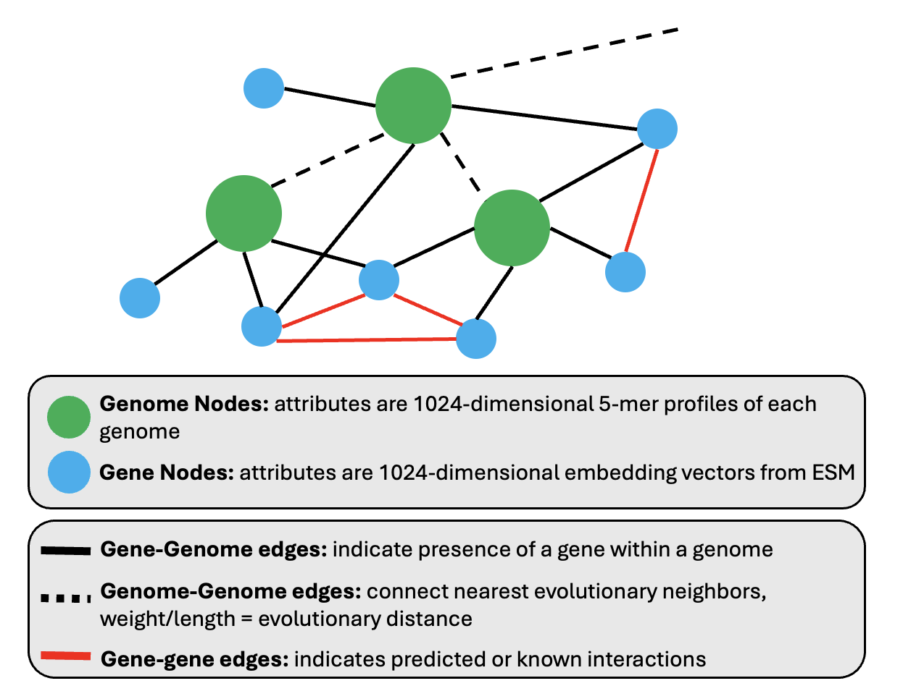

# Masked Graph Learning for Bacterial Genomes

Project: Masked graph learning for bacterial genomics
Goals:
1. Define gene nodes (mostly done)
2. Represent genomes as graphs
3. Implement [GraphMAE](https://arxiv.org/abs/2205.10803)


 
The data:
(https://www.ncbi.nlm.nih.gov/refseq/about/prokaryotes/)
 
For defining gene nodes:
[ESM Atlas](https://esmatlas.com/)
[ESM Cambrian](https://www.evolutionaryscale.ai/blog/esm-cambrian)

## Project Structure

```
.
├── 1_genome_to_graph/
│   ├── 1.3_msa/                          # MMseqs2 clustering results
│   └── 1.4_esm_embedding_clustering/     # ESM embedding generation & analysis
├── data/
│   ├── all_proteins.faa                  # 30M proteins from 7,664 genomes
│   ├── refseq_genomes/                   # Genome sequences (symlink)
│   └── refseq_gene_annotations/          # Gene annotations (symlink)
├── results/
│   └── 1_genome_to_graph/
│       ├── 1.3_msa/mmseqs_seqid_0p7/    # 70% ID clusters (30M assignments)
│       └── 1.4_esm_embedding_clustering/ # PCA cache, UMAP, analysis
├── docs/                                 # Documentation
└── environment.yml                       # Conda/micromamba environment
```
